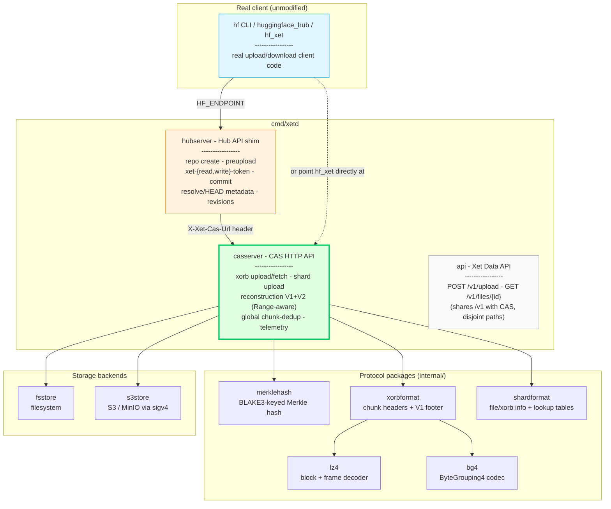
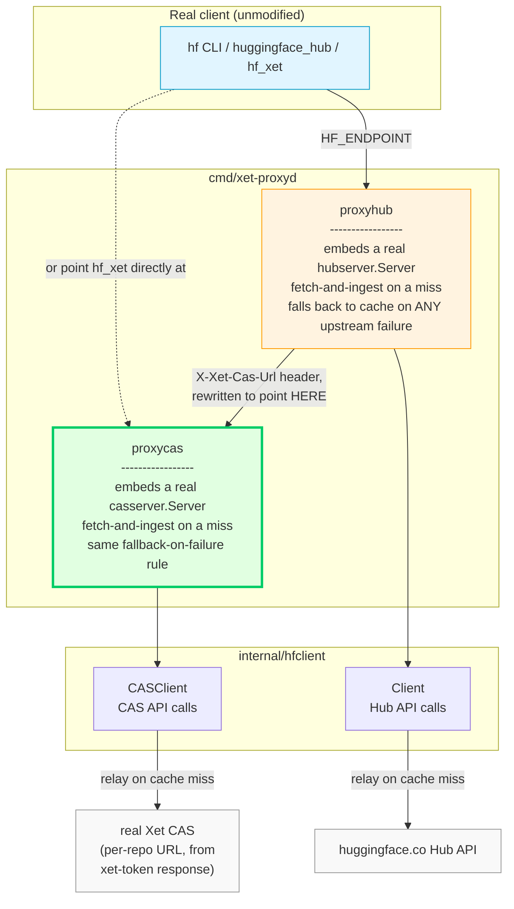
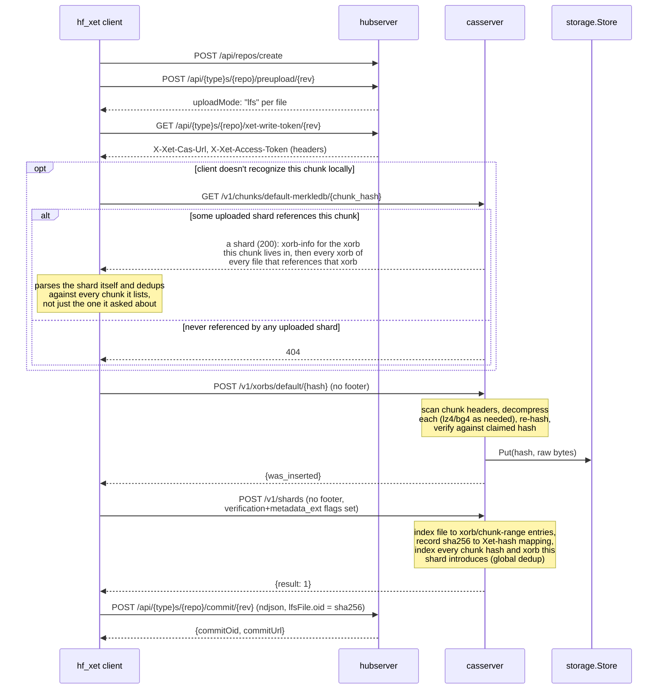
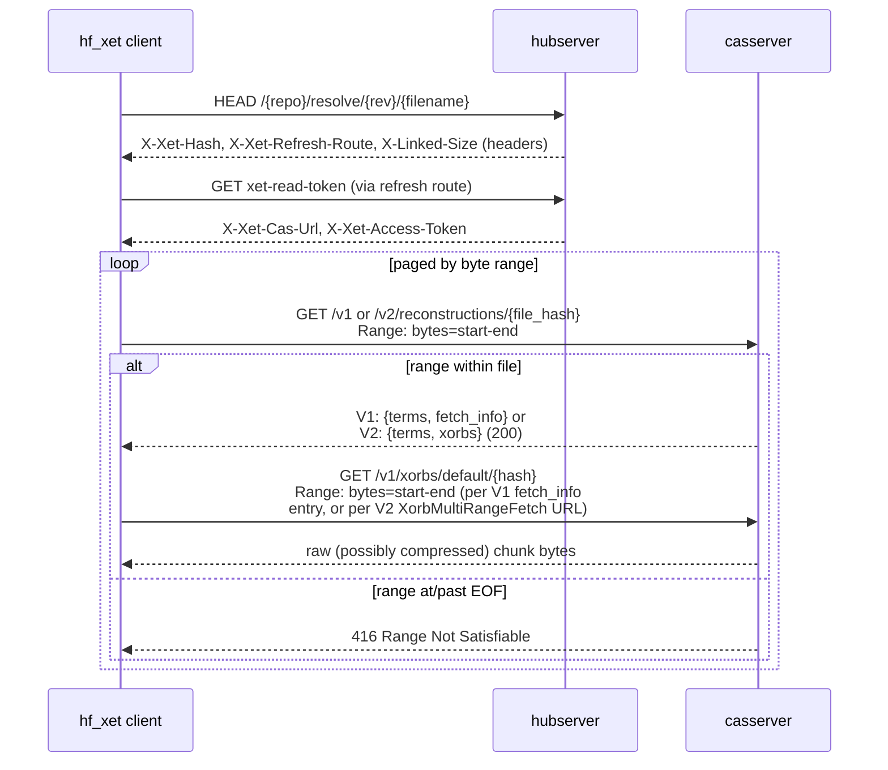

# Architecture

Xet Server is two cooperating HTTP servers - a **CAS (Content Addressable
Storage) server** and a **Hub API shim** - plus a set of protocol packages
that give both servers wire compatibility with Hugging Face's real Xet
ecosystem (`hf_xet`/xet-core), and a simpler standalone Xet Data API kept
alongside the CAS server for quick manual testing.

## System overview



`cmd/xetd` runs the CAS server and the Xet Data API on one shared mux and
port (both under `/v1`, on disjoint literal paths - see
`internal/api`'s exported path constants), plus, if `-hub-addr` is set,
the Hub shim as a second listener on its own port - matching how
huggingface.co's real Hub and CAS are actually separate services, while
keeping this project's own non-wire-compatible testing surface bundled
with CAS rather than given a third port of its own.

## Caching pull-through proxy (`cmd/xet-proxyd`)



`internal/proxycas`/`internal/proxyhub` are thin wrappers around a real,
embedded `casserver.Server`/`hubserver.Server` - the exact same engines
`cmd/xetd` runs - rather than a separate implementation of caching logic.
Each wrapper's own job is narrow: check whether the embedded server
already has what a request needs (via its `Has*` API); if so, delegate
straight to it with no upstream call at all. On a miss, fetch from the
real Hub/CAS via `internal/hfclient`, feed the result into the embedded
server via its `Ingest*` API (`IngestXorb`, `IngestShard`,
`IngestFileRecon`, `IngestRepoInfo`, `IngestFile`, `IngestCommit` - see
each server's own doc comments), then delegate. **Any upstream failure -
network error, timeout, 5xx - falls back to whatever's already cached, no
matter how old**, rather than erroring: this fallback rule is the whole
reason the proxy exists, and it's why `proxycas`/`proxyhub`'s own cache
directory ends up being a byte-for-byte real `xetd` data directory (same
snapshot filenames, same on-disk format) - a caller who's finished relying
on the real huggingface.co can hand that directory to a plain `xetd`
directly, with no proxy process required at all. See
[MIRRORING.md](MIRRORING.md) for the practical version of this story.

The CAS-facing proxy has no fixed upstream CAS URL of its own - real Xet
CAS's base URL is discovered per-repo, via the Hub's own
`xet-{read,write}-token` response, not a well-known address (see
`internal/hfclient`'s package doc comment) - so it learns the real
upstream CAS URL only as a side effect of the Hub-facing proxy relaying
one of those calls (`proxyhub.Server.UpstreamCASBaseURL`). A request to
the CAS-facing port before the Hub-facing port has relayed any traffic at
all gets a `503`, not a hang or a silent wrong answer.

### Caching is best-effort: the partial-xorb constraint

The "hand the directory to a plain `xetd`" story above holds for
everything the proxy actually cached - but against the real Hub that is
routinely a subset of what was downloaded, and the reason is structural
rather than a bug to fix in the caching code.

A xorb is only cached when the proxy can verify the fetched bytes against
that xorb's content hash, since storing them under a hash they don't match
would corrupt the cache. What a reconstruction hands back, though, are the
byte ranges **the requested file needs** - and because Xet deduplicates
across repos, a file frequently references xorbs originally written for
other files and uses only the chunks it shares with them:

```
url_range = 1108398-1679278  (570,881 bytes)   chunk range = 15-21   # of 1042
```

Chunks 15-21 of a 1042-chunk xorb cannot reproduce that xorb's hash, so
`cacheXorbFromFetchInfo` fails and the xorb is skipped. Fetching the whole
xorb instead isn't available either: the real CAS doesn't serve xorb
bodies over `GET /v1/xorbs/` (its allow list is `HEAD,POST` - see
PROTOCOL.md section 12.2), and the presigned URLs are scoped to exactly
the ranges in `fetch_info`.

When this happens `handleReconstructionCommon` logs at `WARN` and falls
back to `relayReconstructionLive`, so the client still completes its
download straight from the CDN - correctness and availability are
preserved; only cache coverage is lost. Caching whole xorbs would require
a different cache granularity (storing verified *chunk ranges* keyed by
`(xorb, range)` and serving reconstructions from those), which is a
larger change to the storage model than the current content-addressed
xorb store.

The practical consequence: for a *guaranteed* complete offline library,
seed via the upload path instead - `hf_xet` chunks the local file itself
and always writes whole xorbs, so `IngestXorb` verifies cleanly. See
[MIRRORING.md](MIRRORING.md) section 10.

## Upload flow



The two "no footer" notes are the load-bearing detail: real `hf_xet`
clients strip the footer/lookup-table sections from both xorb and shard
uploads before sending them, and expect the **server** to reconstruct that
metadata by scanning headers. See [PROTOCOL.md](PROTOCOL.md) for how this
was discovered and why it's correct per xet-core's own source.

The `opt`/`alt` block above is global, cross-upload dedup (does *any*
previously-uploaded shard already reference this chunk), distinct from
the within-this-upload dedup the xorb/shard steps below it already
provide (a `Put`/hash check against what this same upload has already
sent). See [PROTOCOL.md](PROTOCOL.md) #9 for why the response is a whole
shard, not a simple boolean, and why it is assembled to cover the file
rather than being the shard that happened to introduce the chunk: a
client asks about a file's first chunk and then at most once per 256
chunks, so the first answer is most of what it will learn.

## Download flow



The client tries V2 first and falls back to V1 on `404`/`501` (this server
always supports both, so V2 is used in practice); both return the same
underlying terms and byte ranges, differing only in whether ranges for the
same xorb are grouped under one fetch URL (V2) or repeated per term (V1)
- see [PROTOCOL.md](PROTOCOL.md) #10.

The `416`-at-EOF behavior is required, not optional: `hf_xet` pages through
large files by re-requesting `/v1/reconstructions` with successively higher
`Range` windows, and treats `416` as "no more data, stop" - an empty `200`
instead leaves its sequential writer waiting forever for a term that will
never arrive (this was the second real bug found in this project; see
PROTOCOL.md).

## Package responsibilities

| Package | Responsibility |
|---|---|
| `internal/merklehash` | Byte-for-byte port of xet-core's `DataHash`: BLAKE3-keyed leaf/interior-node hashing, the Merkle-aggregation algorithm (branching factor 4, natural-cut rule), and the non-obvious hex-encoding byte-order transform. Verified against xet-core's own published reference vectors. |
| `internal/xorbformat` | Xorb chunk header (version/compressed-length/scheme/uncompressed-length) and the V1 footer format (chunk hashes + boundary offsets). A CAS server almost never needs the footer on the wire - see PROTOCOL.md - but this package can both parse and produce it for local round-trip testing. |
| `internal/shardformat` | Shard header/footer, file-info and xorb-info content sections (including the verification/metadata_ext trailing entries real clients always send), and the three lookup tables. Supports reading both a full shard (with footer) and a footer-less real-client upload. |
| `internal/lz4` | LZ4 block + frame decompression, written from the public LZ4 format specs. Needed because a CAS server must decompress and re-hash chunk payloads to verify a client's claimed hash, regardless of which compression scheme was used. |
| `internal/bg4` | The `ByteGrouping4` reverse transform xet-core applies before LZ4 for the `ByteGrouping4LZ4` scheme. |
| `internal/sigv4` | AWS Signature Version 4 request signing (header-based and query-string presigning), written from the public AWS spec - used by `s3store`, not tied to any AWS SDK. |
| `internal/storage` | The `Store` interface (`Put`/`Get`/`GetRange`/`Has`, streaming via `io.Reader`/`io.ReadCloser`) plus optional capability interfaces (`URLPresigner`, `Deleter`, `Sizer`), with `fsstore` (filesystem) and `s3store` (S3/MinIO via `sigv4`) implementations. |
| `internal/eviction` | An optional background sweep that deletes least-recently-accessed xorbs once total storage exceeds a configured budget, via the `storage.Deleter`/`storage.Sizer` capability interfaces. Off by default. |
| `internal/ratelimit` | A hand-rolled per-source-IP token-bucket limiter gating the xorb/shard upload endpoints. Off by default. |
| `internal/casserver` | The real Xet CAS HTTP API: xorb upload/fetch, shard upload, V1 and V2 (multi-range) reconstruction (Range-aware), a real global chunk-dedup index, telemetry, an operator-facing storage-stats endpoint, and periodic snapshot-based persistence for its in-memory indices. This is where the protocol packages above are wired together into an HTTP surface. |
| `internal/hubserver` | A minimal shim of huggingface.co's Hub REST API (repo create, preupload, xet-token issuance, commit, resolve/HEAD) - separate from the CAS API, since real Hub and CAS are separate services. Supports real, independent revisions/branches per repo, and the same snapshot-based persistence as `casserver`. |
| `internal/chunk`, `internal/manifest`, `internal/api`, `internal/client` | The original, simpler, non-wire-compatible chunk/dedup Xet Data API (gear-hash CDC + JSON manifests) this project started as - mounted at `/v1` alongside CAS, on paths that never collide with it. Kept for quick manual testing via `cmd/xet`/`internal/api`; unrelated to the CAS/Hub protocol work. Has no repo or per-file ownership concept: `file_id` is a content hash, and any caller with read scope can fetch any file it knows the ID of. |
| `internal/auth` | `Authenticator`/`Principal` (server-side AuthN/AuthZ) and `CredentialHelper` (client-side credential attachment) interfaces, plus built-in `NoAuth`/`StaticTokenAuth` and `NoopCredentialHelper`/`BearerCredentialHelper` implementations and the shared `ResolveToken`/`BearerToken` primitives every `-auth-token`-style flag in this project is built on. |
| `internal/routing` | `Mount`/`MountWithVersion`/`Apply` - small helpers so `casserver`, `internal/api`, `hubserver`, and `cmd/xetd`'s own top-level mux each build their route table as one declarative list instead of a sequence of individual `mux.Handle` calls. |
| `internal/apidocs` | Embeds this project's hand-authored OpenAPI 3.0 spec (`openapi.yaml`) and the vendored Swagger UI static assets (`third_party/swagger-ui-dist`) into the `xetd` binary via `go:embed`, serving both at `/api-docs/` - fully offline, no CDN dependency. |
| `internal/landingpage` | Renders the small HTML page shown when a `xetd`/`xet-proxyd` port's root path (`/`) is opened directly in a browser - one variant per port per binary (CAS+Xet-Data, Hub shim, proxy CAS, proxy Hub) - listing that port's endpoints and a quick-start example. |
| `internal/hfclient` | The upstream HTTP client `xet-proxyd` uses to talk to the *real* Hub API and real Xet CAS - `Client` for Hub calls, `CASClient` for CAS calls (a separate base URL, discovered per-repo from a Hub xet-token response, never configured directly). Every call takes the caller's own bearer token and forwards it upstream completely unchanged (pure credential passthrough - this package never holds or uses a secret of its own). Its `defaultHTTPClient` bounds connect/TLS-handshake/response-header latency without a blanket request timeout, so a hung real huggingface.co fails fast without aborting a legitimately large, slow-but-progressing xorb transfer. |
| `internal/reconwire` | The wire types (`ResponseV1`/`ResponseV2`/`Term`/etc.) and response-building logic (`BuildV1`/`BuildV2`) behind `GET /v1\|v2/reconstructions/{file_id}` - extracted out of `casserver` so this clipping/grouping logic has one independently-tested home, callable from both `casserver`'s own handlers and (indirectly, via `casserver.Server.IngestFileRecon`) `proxycas`'s cached-reconstruction path. Bounds-checks every chunk-index field before indexing a footer's slices, since entries reaching it via `proxycas` originated from an untrusted upstream response. |
| `internal/proxycas` | The CAS-facing half of `xet-proxyd`: a thin wrapper embedding a real `casserver.Server` as its serving engine. On each request, checks whether the embedded server already has what's needed (`Has*`); on a miss, fetches from the real Xet CAS via `internal/hfclient`, feeds it into the embedded server via `Ingest*`, then delegates. Any upstream failure falls back to whatever's already cached, regardless of age - this fallback is the whole reason the proxy exists. |
| `internal/proxyhub` | The Hub-facing half of `xet-proxyd`: the same embed-and-delegate design as `proxycas`, wrapping a real `hubserver.Server`. Xet-token is the one endpoint that can't delegate to the embedded server at all (`hubserver`'s own handler mints a fake token, worthless against the real CAS) - this package caches the real token value itself, with `CasURL` rewritten to point at the proxy's own CAS-facing address. `-cache-ttl` controls how long cached metadata is served before attempting a live refresh; it never affects whether the fallback-on-failure rule applies. |
| `cmd/xet-proxyd` | The binary wiring `proxycas`+`proxyhub` together into a two-port caching pull-through proxy for the real huggingface.co - see [Caching pull-through proxy](#caching-pull-through-proxy-cmdxet-proxyd) above for the full design and [MIRRORING.md](MIRRORING.md) for the practical offline-handoff story. |

## Design decisions worth knowing

- **No decompression on the write path unless verifying.** The CAS server
  stores xorb bytes as an opaque blob (matching real production CAS's
  role) and only decompresses transiently, during upload, to compute the
  chunk hashes needed to verify the client's claimed xorb hash. It never
  needs to decompress again after that.
- **Auth is pluggable and off by default.** `casserver`, `hubserver`, and
  `internal/api` each take an `auth.Authenticator` (default `auth.NoAuth{}`,
  i.e. no enforcement - every pre-v0.8.0 deployment's exact behavior) and
  gate each route by the scope (`read`/`write`) the real Xet/HF convention
  implies for it; each server's own operator/health endpoints (telemetry,
  storage-stats, Xet Data's `stats`) are deliberately never gated. `xetd
  -auth-token <secret>` (or `$XETD_AUTH_TOKEN`/`$HF_TOKEN`) installs the
  built-in `auth.StaticTokenAuth`/`auth.BearerCredentialHelper` pair - a
  single shared bearer token - but a deployment needing real per-user
  identity implements its own `Authenticator`/`CredentialHelper` against
  whatever it already has; neither server package needs to change.
- **Presigned URLs are optional, not required.** `fetch_info` URLs point at
  a presigned S3/MinIO URL when the storage backend implements
  `storage.URLPresigner`, or fall back to the CAS server's own
  `/v1/xorbs/{prefix}/{hash}` byte-serving endpoint otherwise. Both are
  spec-valid; production Xet always uses the presigned-URL path. What
  the client assumes either way is that the URL carries its own
  credential: xet-core fetches it with no `Authorization` header. So
  with auth on, the fallback URL is signed the way a presigned one is
  (`casserver.SetFetchURLSigner`): a read token for the requesting
  principal, expiring after `-token-ttl`, in the query string, accepted
  only by the xorb GET/HEAD routes. With auth off nothing changes.
- **In-memory indices, periodically checkpointed - not a live database.**
  `casserver.Server` and `hubserver.Server` hold their reconstruction/repo
  state in memory, each behind its own `sync.RWMutex` (one per index map in
  `casserver`; one per repo, plus one for the top-level repo registry, in
  `hubserver`) rather than a single shared lock - no code path needs a
  consistent snapshot across more than one index, so finer-grained locks
  let unrelated concurrent uploads/downloads/repos proceed without
  serializing on each other. Bulk chunk data lives in the pluggable
  `storage.Store` (streamed via `io.Reader`/`io.ReadCloser`, never buffered
  whole in memory, so a multi-GB xorb costs a fixed amount of memory to
  upload/download) and is always durable on its own. The metadata that
  maps files to chunks survives a restart via `Server.Snapshot`/
  `LoadSnapshot`: a periodic (and shutdown-time) atomic JSON checkpoint to
  `-data`, not a write-ahead log - writes between checkpoints are lost if
  the process is killed (not just on a clean exit). See
  [PROTOCOL.md](PROTOCOL.md)'s persistence section for the full tradeoff
  writeup and why atomic-snapshot was chosen over a WAL for this project.
- **The proxy embeds real servers instead of reimplementing caching
  logic.** An earlier design for `xet-proxyd` considered a standalone
  cache implementation duplicating `casserver`/`hubserver`'s own
  byte-range serving, reconstruction-building, and repo/revision
  tracking. `internal/proxycas`/`internal/proxyhub` embed the real
  engines instead: every request either delegates straight to
  already-tested code, or fetches from upstream and feeds the result into
  that same code via its own `Ingest*` API before delegating. This means
  the two hardest parts of a correct Xet cache - byte-range/reconstruction
  serving and repo/revision state - have exactly one implementation each
  in this whole project, not two that could silently drift apart. It's
  also what makes the offline-handoff property fall out for free: the
  embedded server's own snapshot format IS a real `xetd` data directory,
  with no separate export/import step needed.
- **Any upstream failure falls back to cache, unconditionally - this is
  the proxy's retry strategy for reads.** No separate retry-with-backoff
  logic was added for read paths: a network error, timeout, or 5xx from
  the real Hub/CAS immediately serves whatever's already cached,
  regardless of age. This was a deliberate choice over exponential
  backoff or similar - the existing fallback already produces the
  correct user-visible outcome (a working `hf download`) faster than any
  retry loop could, and adding one would only delay reaching that same
  fallback. Writes (commit, preupload, repo/branch creation) are always
  relayed live with no fallback at all - only the real Hub can accept a
  real commit, so there is nothing to fall back to.
