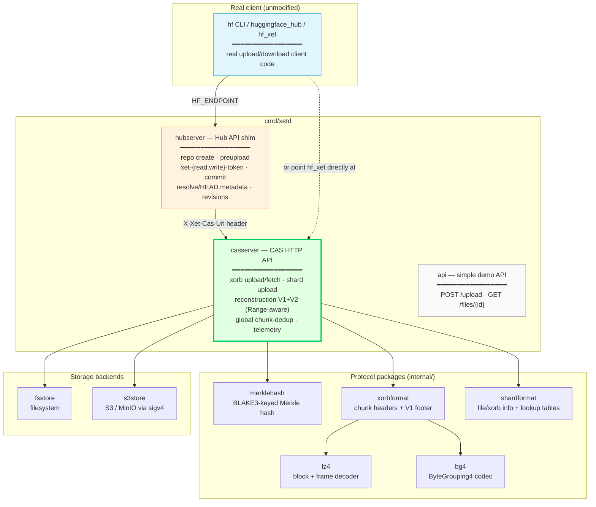
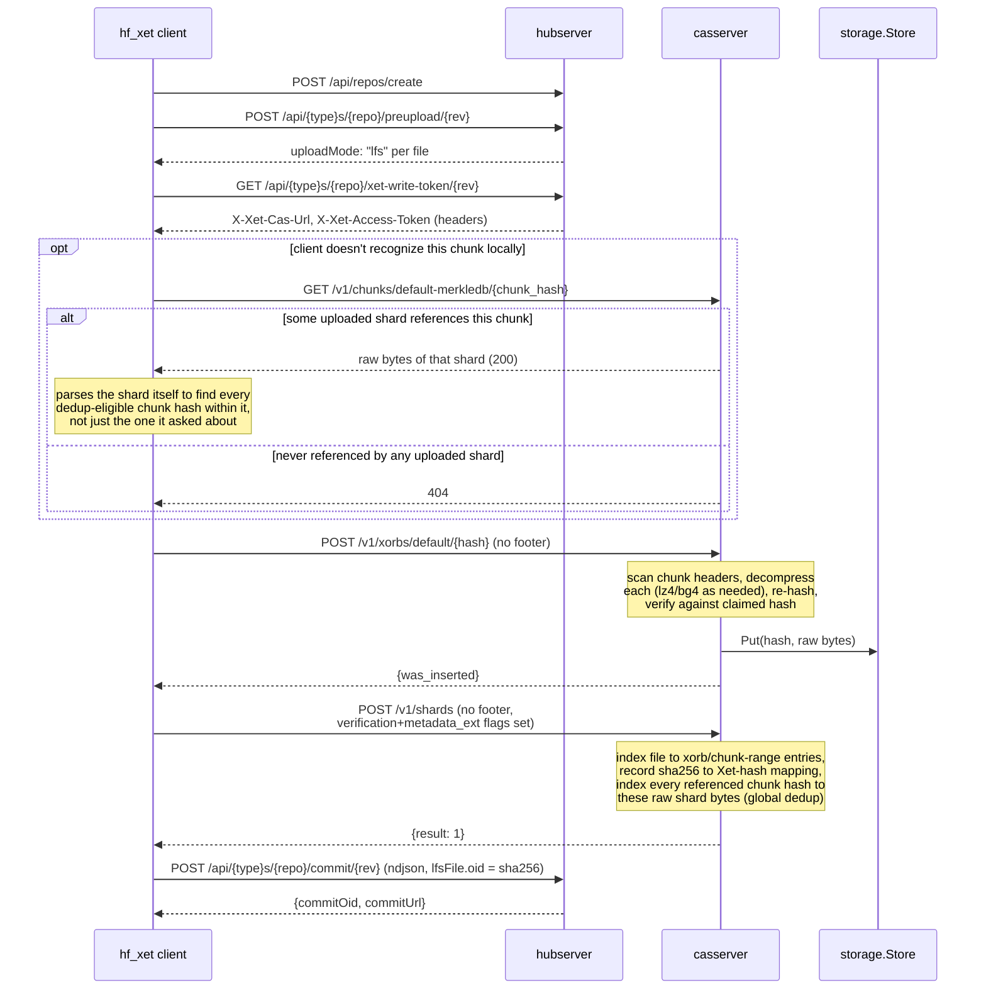
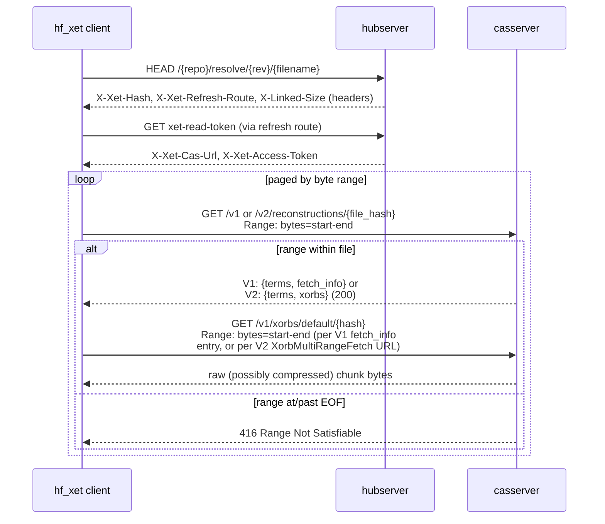

# Architecture

Xet Server is two cooperating HTTP servers — a **CAS (Content Addressable
Storage) server** and a **Hub API shim** — plus a set of protocol packages
that give both servers wire compatibility with Hugging Face's real Xet
ecosystem (`hf_xet`/xet-core), and a simpler standalone demo API kept
alongside them for quick manual testing.

## System overview

`cmd/xetd` runs the CAS server (and, if `-hub-addr` is set, the Hub shim as
a second listener) plus the demo API — three separate `http.Handler`s
mounted on independent muxes/ports, matching how huggingface.co's real Hub
and CAS are actually separate services rather than one monolith.

## Upload flow

The two "no footer" notes are the load-bearing detail: real `hf_xet`
clients strip the footer/lookup-table sections from both xorb and shard
uploads before sending them, and expect the **server** to reconstruct that
metadata by scanning headers. See [PROTOCOL.md](PROTOCOL.md) for how this
was discovered and why it's correct per xet-core's own source.

The `opt`/`alt` block above is global, cross-upload dedup (does *any*
previously-uploaded shard already reference this chunk), distinct from
the within-this-upload dedup the xorb/shard steps below it already
provide (a `Put`/hash check against what this same upload has already
sent). See [PROTOCOL.md](PROTOCOL.md) §9 for why the response is a whole
shard, not a simple boolean.

## Download flow

The client tries V2 first and falls back to V1 on `404`/`501` (this server
always supports both, so V2 is used in practice); both return the same
underlying terms and byte ranges, differing only in whether ranges for the
same xorb are grouped under one fetch URL (V2) or repeated per term (V1)
— see [PROTOCOL.md](PROTOCOL.md) §10.

The `416`-at-EOF behavior is required, not optional: `hf_xet` pages through
large files by re-requesting `/v1/reconstructions` with successively higher
`Range` windows, and treats `416` as "no more data, stop" — an empty `200`
instead leaves its sequential writer waiting forever for a term that will
never arrive (this was the second real bug found in this project; see
PROTOCOL.md).

## Package responsibilities

| Package | Responsibility |
|---|---|
| `internal/merklehash` | Byte-for-byte port of xet-core's `DataHash`: BLAKE3-keyed leaf/interior-node hashing, the Merkle-aggregation algorithm (branching factor 4, natural-cut rule), and the non-obvious hex-encoding byte-order transform. Verified against xet-core's own published reference vectors. |
| `internal/xorbformat` | Xorb chunk header (version/compressed-length/scheme/uncompressed-length) and the V1 footer format (chunk hashes + boundary offsets). A CAS server almost never needs the footer on the wire — see PROTOCOL.md — but this package can both parse and produce it for local round-trip testing. |
| `internal/shardformat` | Shard header/footer, file-info and xorb-info content sections (including the verification/metadata_ext trailing entries real clients always send), and the three lookup tables. Supports reading both a full shard (with footer) and a footer-less real-client upload. |
| `internal/lz4` | LZ4 block + frame decompression, written from the public LZ4 format specs. Needed because a CAS server must decompress and re-hash chunk payloads to verify a client's claimed hash, regardless of which compression scheme was used. |
| `internal/bg4` | The `ByteGrouping4` reverse transform xet-core applies before LZ4 for the `ByteGrouping4LZ4` scheme. |
| `internal/sigv4` | AWS Signature Version 4 request signing (header-based and query-string presigning), written from the public AWS spec — used by `s3store`, not tied to any AWS SDK. |
| `internal/storage` | The `Store` interface (`Put`/`Get`/`GetRange`/`Has`, streaming via `io.Reader`/`io.ReadCloser`) plus optional capability interfaces (`URLPresigner`, `Deleter`, `Sizer`), with `fsstore` (filesystem) and `s3store` (S3/MinIO via `sigv4`) implementations. |
| `internal/eviction` | An optional background sweep that deletes least-recently-accessed xorbs once total storage exceeds a configured budget, via the `storage.Deleter`/`storage.Sizer` capability interfaces. Off by default. |
| `internal/ratelimit` | A hand-rolled per-source-IP token-bucket limiter gating the xorb/shard upload endpoints. Off by default. |
| `internal/casserver` | The real Xet CAS HTTP API: xorb upload/fetch, shard upload, V1 and V2 (multi-range) reconstruction (Range-aware), a real global chunk-dedup index, telemetry, an operator-facing storage-stats endpoint, and periodic snapshot-based persistence for its in-memory indices. This is where the protocol packages above are wired together into an HTTP surface. |
| `internal/hubserver` | A minimal shim of huggingface.co's Hub REST API (repo create, preupload, xet-token issuance, commit, resolve/HEAD) — separate from the CAS API, since real Hub and CAS are separate services. Supports real, independent revisions/branches per repo, and the same snapshot-based persistence as `casserver`. |
| `internal/chunk`, `internal/manifest`, `internal/api`, `internal/client` | The original, simpler, non-wire-compatible chunk/dedup demo (gear-hash CDC + JSON manifests) this project started as. Kept for quick manual testing via `cmd/xet`/`internal/api`; unrelated to the CAS/Hub protocol work. |

## Design decisions worth knowing

- **No decompression on the write path unless verifying.** The CAS server
  stores xorb bytes as an opaque blob (matching real production CAS's
  role) and only decompresses transiently, during upload, to compute the
  chunk hashes needed to verify the client's claimed xorb hash. It never
  needs to decompress again after that.
- **Presigned URLs are optional, not required.** `fetch_info` URLs point at
  a presigned S3/MinIO URL when the storage backend implements
  `storage.URLPresigner`, or fall back to the CAS server's own
  `/v1/xorbs/{prefix}/{hash}` byte-serving endpoint otherwise. Both are
  spec-valid; production Xet always uses the presigned-URL path.
- **In-memory indices, periodically checkpointed — not a live database.**
  `casserver.Server` and `hubserver.Server` hold their reconstruction/repo
  state in memory, each behind its own `sync.RWMutex` (one per index map in
  `casserver`; one per repo, plus one for the top-level repo registry, in
  `hubserver`) rather than a single shared lock — no code path needs a
  consistent snapshot across more than one index, so finer-grained locks
  let unrelated concurrent uploads/downloads/repos proceed without
  serializing on each other. Bulk chunk data lives in the pluggable
  `storage.Store` (streamed via `io.Reader`/`io.ReadCloser`, never buffered
  whole in memory, so a multi-GB xorb costs a fixed amount of memory to
  upload/download) and is always durable on its own. The metadata that
  maps files to chunks survives a restart via `Server.Snapshot`/
  `LoadSnapshot`: a periodic (and shutdown-time) atomic JSON checkpoint to
  `-data`, not a write-ahead log — writes between checkpoints are lost if
  the process is killed (not just on a clean exit). See
  [PROTOCOL.md](PROTOCOL.md)'s persistence section for the full tradeoff
  writeup and why atomic-snapshot was chosen over a WAL for this project.
